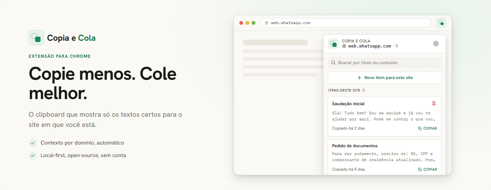
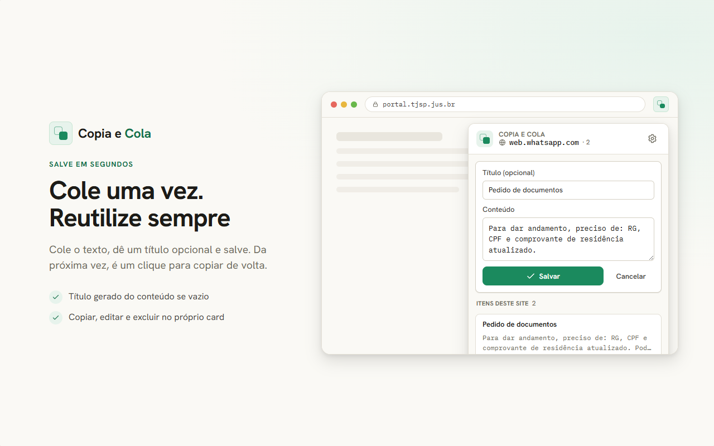
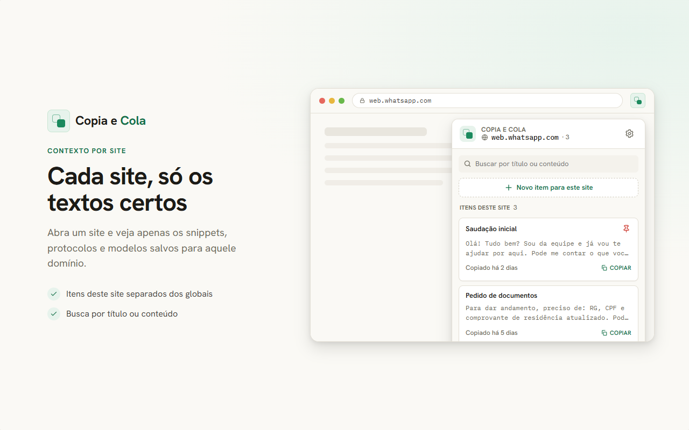
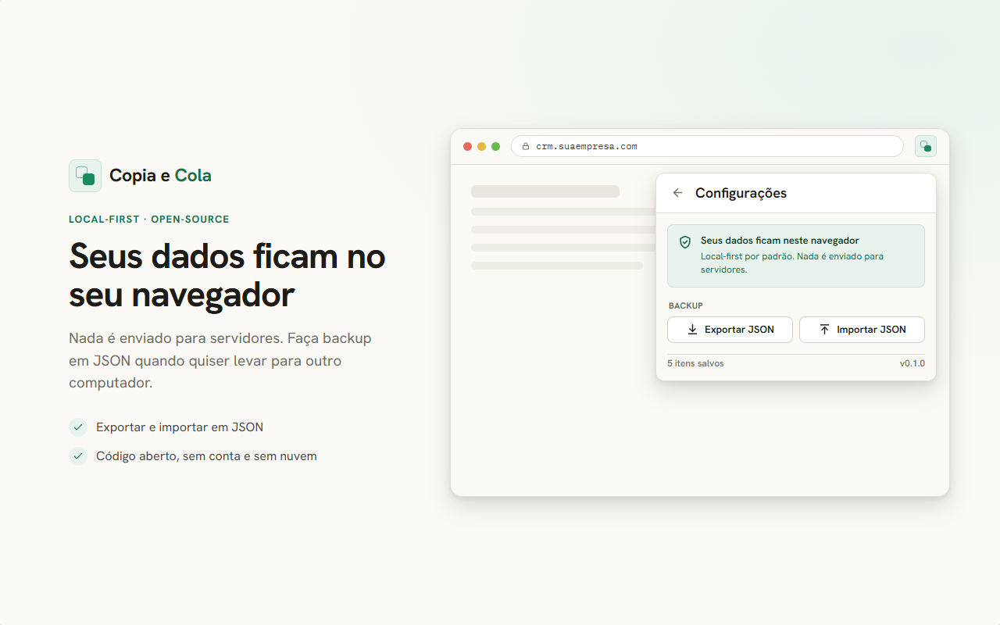

# 📋 Copia e Cola

<p align="center">
  
</p>

<p align="center">
  <a href="LICENSE"></a>
  <a href="https://wxt.dev/"></a>
</p>

> **Copia e Cola** é um micro SaaS open-source e local-first para guardar textos, prompts, protocolos e modelos de resposta separados por **contexto (site/domínio)** direto no seu navegador.

A ideia inicial é simples: ao abrir um site, você vê **apenas os itens salvos para aquele domínio**. Chega de misturar os conteúdos de trabalho do WhatsApp Web com respostas de tribunais, portais públicos, CRMs ou ferramentas internas.

---

## ✨ Funcionalidades (MVP)

- 🔒 **Local-first:** Seus dados nunca saem do seu navegador por padrão. Privacidade em primeiro lugar.
- 🌐 **Contexto por Site:** Salve e veja textos atrelados especificamente ao domínio que você está visitando.
- 📋 **Cópia Rápida:** Copie com um clique e ganhe produtividade no seu fluxo diário.
- 🏷️ **Títulos Opcionais:** Organize seus textos com títulos para fácil identificação.
- ⚙️ **Gerenciamento Completo:** Edite, exclua, fixe e pesquise seus itens através de um painel global.
- 💾 **Backup Simples:** Exporte e importe seus dados em JSON a qualquer momento, sem sobrescrever o que você já tem.

### Como funciona na prática:

<div align="center">
  
  
  
</div>

---

## 🚀 Como instalar e testar (Modo Desenvolvedor)

Como estamos em fase de MVP e o projeto ainda não está na Web Store, você pode instalar localmente no seu Chrome ou Edge:

1. Abra a página de extensões do seu navegador: `chrome://extensions` ou `edge://extensions`.
2. Ative o **Modo do desenvolvedor** (normalmente um interruptor no canto superior direito).
3. No terminal, clone este repositório e instale as dependências:
   ```bash
   npm install
   npm run build
   ```
4. Volte à página de extensões, clique em **Carregar sem compactação** (Load unpacked) e selecione a pasta `dist/` gerada no repositório.
5. Fixe a extensão na sua barra de tarefas e abra em qualquer site!

---

## 🛠️ Stack e Organização do Repositório

Projeto construído em **React**, focado em **TypeScript**, e empacotado pelo **WXT** (gerador de extensões focado em Manifest V3).

- 📂 `entrypoints/`: Telas WXT/React publicáveis (Popup, Options, Background, etc).
- 📂 `src/`: Core local open-source, lógica, componentes UI e estilos.
- 📂 `public/`: Assets nativos exigidos para o build da extensão.
- 📂 `store/` e `design-system/`: Screenshots, materiais visuais promocionais da Chrome Web Store e guias de UX.
- 📂 `tests/` e `scripts/`: Testes unitários do core, validações de pacote e geração de assets.
- 📂 `docs/` e `specs/`: PRD, ADRs (Decisões de Arquitetura), fluxos de validação e roadmap do produto.
- 📂 `site/`: Landing page oficial.

> 📝 **Nota:** O backend cloud oficial (para features avançadas como sync, IA, permissões em time) vive em um projeto privado à parte.

---

## 💻 Desenvolvimento

Requisitos mínimos: **Node.js 20+**

```bash
# Instala dependências
npm install

# Roda lint, testes unitários, valida de manifest e pacotes
npm run check

# Testa build final, faz smoke test em navegador real e gera zip final em dist/
npm run publish:ready
```

**Testes End-to-End:**
Temos um script de teste que sobe a extensão num perfil temporário do Chromium para validar fluxos reais de salvar, contexto do domínio, persistência, etc:
```bash
npm run chrome:smoke
```

---

## 🎯 Nossos Princípios

1. **Brasil primeiro:** Foco enorme em operações de backoffice brasileiras, despachantes, processos jurídicos (PJe, Projudi), atendimento (WhatsApp, CRMs) e desenvolvimento de software (prompts, code snippets).
2. **Local-first:** Nenhum dado privado vai para a nuvem sem o usuário pedir.
3. **Open-source:** O motor principal deve ser gratuito e auditável por qualquer pessoa.
4. **Simples antes de inteligente:** O MVP resolve um Ctrl+C / Ctrl+V bem feito. Recursos de IA generativa virão como complemento, não como obstáculo.

---

## 📄 Licença e Marcas

Este código-fonte é distribuído sob a licença **MIT**. Veja o arquivo [LICENSE](LICENSE) para detalhes.

⚠️ **Atenção:** Embora o código seja livre, a marca **Copia e Cola**, logotipo, screenshots e identidade visual do `design-system/` **não concedem** direito de uso comercial em forks ou uploads de lojas terceiras. Para mais contexto sobre limites de uso de marca, consulte o documento de [TRADEMARKS.md](TRADEMARKS.md).
